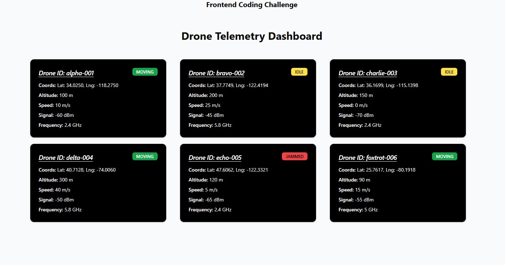

# Frontend Coding Challenge

## Getting Started

### Install

```bash
npm install
```

### Run the Dev Server

```bash
npm run dev
```

### Run Tests

```bash
npm run test
```

## Screenshot



---
